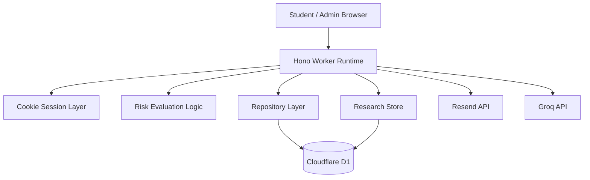

# Mindscape Backend Architecture

## Overview

Mindscape runs as a Cloudflare Worker with Hono routing, D1 persistence, cookie-based admin sessions, and a local-or-Groq research assistant. The runtime supports two modes:

- `d1-configured`: production path with persistent student data and research history
- `demo-memory`: fallback mode for tests and local runs without a `DB` binding

## Runtime Topology

## Request Layers

Current request handling is organized as:

1. Routes in `src/index.tsx`
2. Domain logic in focused modules:
   - `src/lib/risk.ts`
   - `src/lib/research-assistant.ts`
   - `src/lib/health.ts`
3. Data access in:
   - `src/lib/repository.ts`
   - `src/lib/research-store.ts`
4. Database bootstrap in `src/lib/d1-bootstrap.ts`

This keeps UI rendering in the route layer and pushes persistence and backend state into dedicated modules.

## Data Domains

### Student data

Persistent entities:

- `institutions`
- `cohorts`
- `admin_users`
- `daily_pulses`
- `weekly_screeners`
- `support_requests`
- `risk_events`
- `academic_calendar_events`
- `resources`
- `magic_tokens`

### Research assistant data

Persistent entities:

- `research_entries`
- `assistant_questions`

`research_entries` is seeded from `mindscape_research_reference.docx`-derived local content. `assistant_questions` stores every answered question and the source IDs used.

## Startup and Bootstrap Model

When `env.DB` exists, the repository and research store both call `ensureD1Ready(db)`.

Bootstrap responsibilities:

1. Create required tables and indexes if missing
2. Seed the demo institution, cohorts, admins, resources, and calendar entries idempotently
3. Seed demo student data idempotently
4. Seed the research reference entries idempotently

This means the Worker can cold-start against an empty D1 database without a separate application-side migration runner, though formal migrations are still recommended for controlled production change management.

## Write Path Guarantees

The D1 repository batches related writes so multi-record operations stay consistent at the request level.

Examples:

- daily pulse insert + generated risk event
- weekly screener insert + generated risk event
- support request insert + generated risk event

This is stronger than sequential inserts because the Worker issues one grouped database call per workflow.

## Health and Runtime Status

`GET /api/health` returns:

- service mode
- production readiness
- D1 readiness
- email delivery mode
- AI mode
- session cookie security mode
- warnings for missing production prerequisites

This endpoint is intended for smoke tests and deployment checks, not just uptime probing.

## Session Model

Admin auth uses signed cookies. Cookie security is environment-aware:

- `secure: true` when `APP_ORIGIN` is HTTPS
- `secure: false` in local HTTP development

This avoids the common local-dev failure where secure cookies never persist on `http://127.0.0.1`.

## Failure Boundaries

### D1 unavailable

- Health endpoint reports degraded status
- Production mode is not ready
- Requests using the D1 repository fail rather than silently pretending persistence succeeded

### Resend unavailable

- Magic-link flow stays functional in preview mode
- Health endpoint reports preview email mode

### Groq unavailable

- Reflection analysis and assistant answers fall back to deterministic local behavior
- Core student-data persistence is unaffected

## Recommended Next Scale Step

If the product grows beyond pilot scale, the next backend split should be:

1. extract route workflows from `src/index.tsx` into dedicated service modules
2. add explicit migration versioning instead of bootstrap-only schema creation
3. add admin audit logging for sign-in, token issuance, and dashboard access
4. add request-level structured logging and rate limiting
